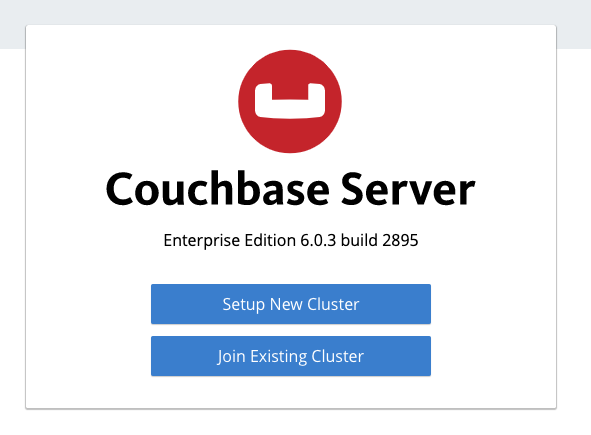
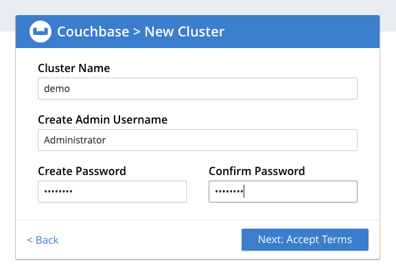
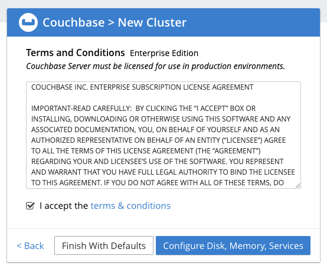
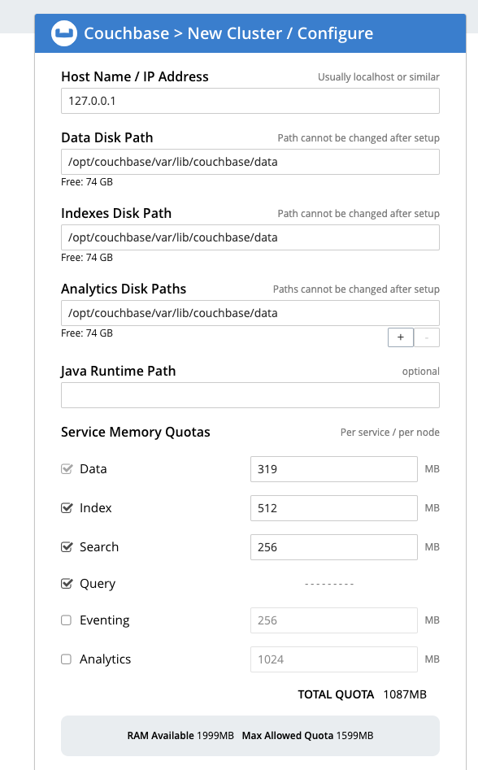
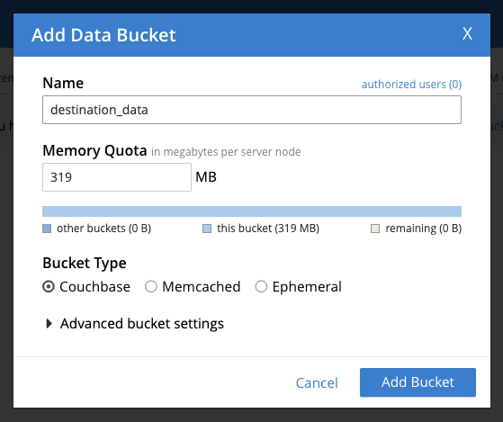
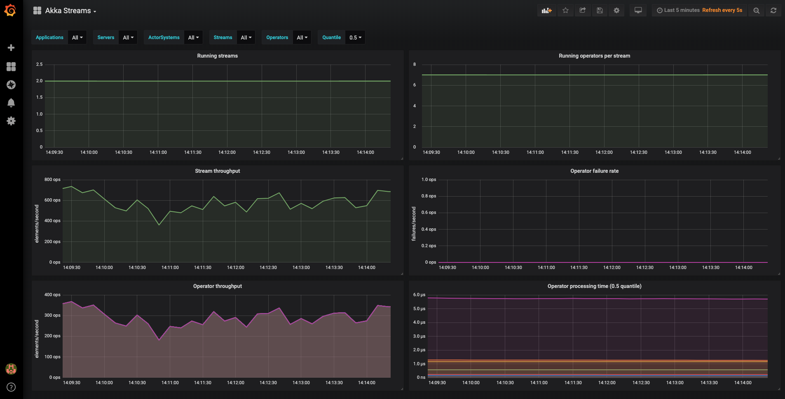

# Alpakka Demo: Postgres ⇒ Couchbase

## Requirements

* JDK 8 or greater
* docker && docker-compose
* Lightbend Commercial Credentials

## Quickstart

* Download and start the [Lightbend Telemetry Prometheus Sandbox](https://developer.lightbend.com/docs/telemetry/current/sandbox/prometheus-sandbox.html)
* Build the Postgres Source Database

```shell script
cd docker/demo
docker build -t alpakka-demo-postgres-image .
```

* Start the Postgres source database and the Couchbase destination database

```shell script
docker-compose up
```

* Setup the Couchbase cluster and bucket
    * Visit http://localhost:8091 in a browser
    * Click 'Setup New Cluster'
    * 
    * Create new cluster with Cluster Name = `demo` and Password `admin123`
    * 
    * Accept the terms
    * 
    * Depending on your memory allocation you may want to disable `Eventing` and `Analytics`
    * 
    * Create a new bucket named `destination_data`
    * 

* Run the demo application

```shell script
sbt "alpakka-jdbc-demo/run"
```

* View the Telemetry results for the running stream



## (Re)Generating the source database

### Quick Way

> Use this method if you don't need to change the source data in any way - if you're just working on the transformation logic, for instance.

You can use the pre-generated docker image that already has the data loaded.

```shell script
cd docker/demo
docker build -t alpakka-demo-postgres-image .
docker-compose up -d
```

This will build the postgres image with source data loaded and then start 2 containers - one running postgres (with source data loaded) and the other running couchbase.

### Long Way

If you want to change the shape of the source data you'll need to generate the source data and (re)build the postgres image with the new data loaded.

* Make any necessary changes to the `data-generator` project so that it's generating the data correcxtly for you (# of records, adding/removing fields etc.)
* Run the `data-generator` project - this will generate a new file at `./docker/generator/docker-entrypoint-initdb.d/generated-records.csv`
* Build and run the `generator` docker image and dump the data out

> Make sure you've deleted the `./db-data` directory - otherwise the database won't initialise and load the CSV data

```shell script
cd docker/generator
docker build -t alpakka-demo-data-image .
docker run -it --rm --name alpakka-demo-data alpakka-demo-data-image
docker exec alpakka-demo-data pg_dump -U postgres --format custom alpakka_demo > ../demo/docker-entrypoint-initdb.d/alpakka_demo.pgdata
```

* Now you can rebuild the demo image

```shell script
cd docker/demo
docker build -t alpakka-demo-postgres-image .
```

* Lastly, in order to get the database to initialise you'll need to clear the existing data directory

```shell script
rm -rf db-data
```

Now you can run `docker-compose up` and bring the new database up. You'll see log output that looks something like this:

```shell script
postgres_1   | Restoring alpakka_demo using /docker-entrypoint-initdb.d/alpakka_demo.pgdata
postgres_1   | pg_restore: connecting to database for restore
postgres_1   | pg_restore: creating TABLE "public.unbilled_data"
postgres_1   | pg_restore: processing data for table "public.unbilled_data"
postgres_1   | pg_restore: creating CONSTRAINT "public.unbilled_data unbilled_data_pkey"
postgres_1   | pg_restore: creating DEFAULT ACL "public.DEFAULT PRIVILEGES FOR SEQUENCES"
postgres_1   | pg_restore: creating DEFAULT ACL "public.DEFAULT PRIVILEGES FOR TABLES"
```

The source data is quite large (millions of rows) so can take a little time to load.
